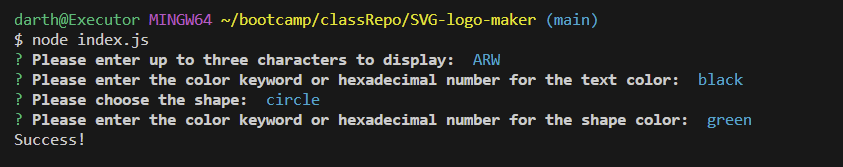

# SVG Logo Maker

## Description

This is an SVG generator that will take in text, shape, and color options to then output an SVG file with the corresponding info.

## Screenshot

## Link

Video of application in use: https://drive.google.com/file/d/1I_lWmSWCmJ_RFr9N8YNdgNqKUVDl_jwh/view